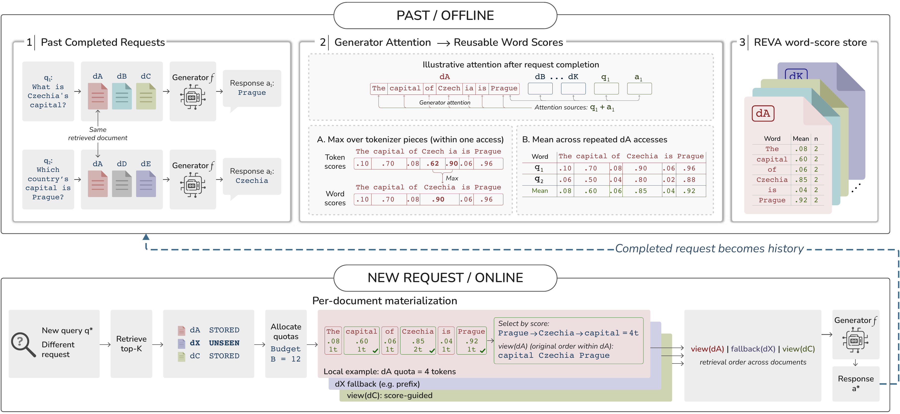

# REVA: Reusable Evidence View Aggregation

Artifact repository for:

> **REVA: Reusable Evidence View Aggregation for Context-Efficient RAG Serving**  
> Accepted at **IEEE ICDM 2026**.

REVA is a post-retrieval compression pipeline for retrieval-augmented generation (RAG). Instead of compressing every request from scratch, REVA mines historical query-document-model interactions into reusable document evidence views. At serving time, it looks up stored word-unit scores, materializes a budget-specific plain-text context, and sends that context to the same downstream generator.

The RAG interface stays ordinary: the generator receives text. REVA does not require KV-cache APIs, latent memory, or generator architecture changes.

## Pipeline



Offline, completed RAG requests are scored with the target generator's attention. Token scores are mapped into readable word units and averaged across repeated document accesses to build a document-keyed score store. Online, a new request retrieves top-$K$ documents, reuses stored word scores when available, falls back to prefix truncation for unseen documents, and renders selected word units under the requested budget.

## Data Artifacts

Temporary Google Drive links are provided until the Zenodo DOI is ready:

- [Retrieval top-20 artifact](https://drive.google.com/file/d/1buhg89g4n5j4tGiDj_94K1F0bflNzhFb/view?usp=sharing)
- [REVA compact score cache](https://drive.google.com/file/d/1vO7EmnzyV2-Fqg8KudX-oT2haiwY8uPe/view?usp=sharing)

Recommended local layout after download:

```text
data/
  retrieval_top20_4datasets_with_answers.jsonl.gz
  score_cache_reva_v1/
    score_cache_manifest.json
    score_cache_verify.tsv
    score_cache_checksums.sha256
    scores_reva_v1__llama31__qpa__reversed__topk10.jsonl.gz
    scores_reva_v1__llama31__q__reversed__topk10.jsonl.gz
    scores_reva_v1__qwen35__qpa__reversed__topk10.jsonl.gz
    scores_reva_v1__qwen35__q__reversed__topk10.jsonl.gz
    scores_reva_v1__gemma4e4b__qpa__reversed__topk10.jsonl.gz
    scores_reva_v1__gemma4e4b__q__reversed__topk10.jsonl.gz
```

Verify the score-cache download:

```bash
cd data/score_cache_reva_v1
shasum -a 256 -c score_cache_checksums.sha256
```

The retrieval artifact stores question metadata and retrieved document IDs:

```json
{"dataset":"nq","split":"test","id":"test_0","question":"...","answers":["..."],"doc_ids":["..."]}
```

The compact score cache stores one row per scored document:

```json
{"dataset":"nq","doc_id":"10000220","hits":9,"scores":[0.0,0.0,0.000031]}
```

The `scores` array contains word-unit scores. To render compressed text, pair these scores with the corresponding document text and the same REVA word-unit reconstruction code.

## Repository Layout

```text
src/
  cli.py              command-line entrypoint
  schema.py           examples, contexts, JSON/JSONL helpers
  models.py           prompt formatting, model loading, generation
  metrics.py          token counts, EM/F1/ROUGE-L, summaries
  runner.py           shared benchmark loop
  methods.py          method registry
  baselines.py        raw, truncation, and thin baseline wrappers
  reva.py             REVA scoring, score-store construction, selection, rendering
  retrieval_build.py  wiki18/E5 retrieval artifact builder
```

The main implementation is [src/reva.py](src/reva.py). The primary method IDs are `reva` and `reva_query_aware`.

## Setup

```bash
uv sync --locked
```

Optional extras:

```bash
uv sync --locked --extra retrieval   # FAISS/E5 retrieval build
uv sync --locked --extra baselines   # optional baseline wrappers
```

Run commands from the repository root with `PYTHONPATH=src`.

## Input Format

The benchmark runner expects JSONL rows with a question and retrieved contexts:

```json
{"id":"q1","question":"...","answers":["..."],"contexts":[{"doc_id":"d1","title":"...","text":"...","chunk_id":"..."}]}
```

Use a stable `chunk_id` when multiple chunks share a `doc_id`.

## Quick Start

Build a native REVA score store from historical or training retrieval examples:

```bash
PYTHONPATH=src uv run python -m cli build-store \
  --input data/train.jsonl \
  --model meta-llama/Llama-3.1-8B-Instruct \
  --option max_scoring_tokens=8192 \
  --output outputs/reva_store
```

Run REVA from a prebuilt store:

```bash
PYTHONPATH=src uv run python -m cli run \
  --input data/test.jsonl \
  --method reva \
  --budget 512 \
  --option score_store_path=outputs/reva_store/score_store.jsonl \
  --output outputs/reva_b512
```

Run the query-aware diagnostic variant without a prebuilt store:

```bash
PYTHONPATH=src uv run python -m cli run \
  --input data/test.jsonl \
  --method reva_query_aware \
  --budget 512 \
  --option scoring_model_name=meta-llama/Llama-3.1-8B-Instruct \
  --output outputs/reva_query_aware_b512
```

`build-store` writes `score_store.jsonl` and `summary.json`. `run` writes `records.jsonl` and `summary.json`. Add `--model ...` to `run` when you also want answer generation and EM/F1/ROUGE-L evaluation.

## Retrieval Build

`retrieval-build` prepares the wiki18/E5 retrieval artifacts used by the paper pipeline:

```bash
PYTHONPATH=src uv run --extra retrieval python -m cli retrieval-build \
  --stage all \
  --data-root retrieval_artifacts
```

The builder downloads the wiki18 corpus, encodes passages with `intfloat/e5-base-v2`, and builds a FAISS Flat inner-product index. You can also run `--stage download`, `--stage encode`, or `--stage index` separately.

## How Scores Are Used

REVA stores scores at word-unit granularity. A word unit is an alphanumeric span aligned to tokenizer offsets:

```text
Doc: "Paris is the capital of France."

index  unit      score
0      Paris     0.91
1      is        0.08
2      the       0.03
3      capital   0.77
4      of        0.04
5      France    0.88
```

Under a small budget, REVA selects high-score word units, then renders them in the original document order:

```text
Selected by score: Paris, France, capital
Rendered context:  Paris capital France
```

Documents missing from the score store use prefix truncation under the same document quota.

## Citation

Citation metadata, DOI, and a public paper link will be added when the official ICDM 2026 proceedings or arXiv page is available.
